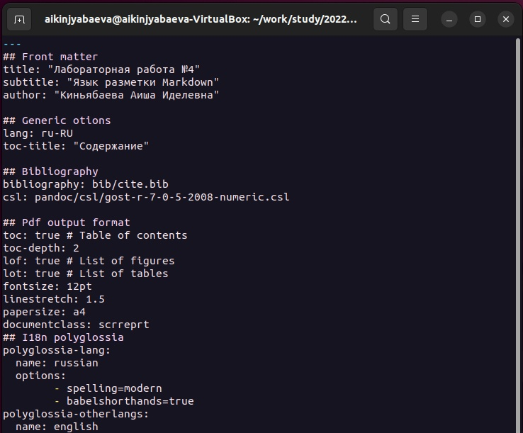

---
## Front matter
title: "Лабораторная работа №4"
subtitle: "Язык разметки Markdown"
author: "Киньябаева Аиша Иделевна"

## Generic otions
lang: ru-RU
toc-title: "Содержание"

## Bibliography
bibliography: bib/cite.bib
csl: pandoc/csl/gost-r-7-0-5-2008-numeric.csl

## Pdf output format
toc: true # Table of contents
toc-depth: 2
lof: true # List of figures
lot: true # List of tables
fontsize: 12pt
linestretch: 1.5
papersize: a4
documentclass: scrreprt
## I18n polyglossia
polyglossia-lang:
  name: russian
  options:
	- spelling=modern
	- babelshorthands=true
polyglossia-otherlangs:
  name: english
## I18n babel
babel-lang: russian
babel-otherlangs: english
## Fonts
mainfont: PT Serif
romanfont: PT Serif
sansfont: PT Sans
monofont: PT Mono
mainfontoptions: Ligatures=TeX
romanfontoptions: Ligatures=TeX
sansfontoptions: Ligatures=TeX,Scale=MatchLowercase
monofontoptions: Scale=MatchLowercase,Scale=0.9
## Biblatex
biblatex: true
biblio-style: "gost-numeric"
biblatexoptions:
  - parentracker=true
  - backend=biber
  - hyperref=auto
  - language=auto
  - autolang=other*
  - citestyle=gost-numeric
## Pandoc-crossref LaTeX customization
figureTitle: "Рис."
tableTitle: "Таблица"
listingTitle: "Листинг"
lofTitle: "Список иллюстраций"
lotTitle: "Список таблиц"
lolTitle: "Листинги"
## Misc options
indent: true
header-includes:
  - \usepackage{indentfirst}
  - \usepackage{float} # keep figures where there are in the text
  - \floatplacement{figure}{H} # keep figures where there are in the text
---

# Цель работы

Целью работы является освоение процедуры оформления отчетов с помощью легковесного языка разметки Markdown.

# Задание

Установка pandoc и pandoc-crossref. Скачивание шаблона отчета лабораторной работы с Github. Дальнейшее создание отчета на основе данного шаблона и загрузка файла.

# Теоретическое введение

***Оформление изображений в Markdown**

 В Markdown вставить изображение в документ можно с помощью непосред-
ственного указания адреса изображения. Синтаксис данной команды выглядит
следующим образом:

 { #fig:fig1 width=70% }

 Здесь:

 1. • в квадратных скобках указывается подпись к изображению;
 2. • в круглых скобках указывается URL-адрес или относительный путь изображения, а также (необязательно) всплывающую подсказку, заключённую в двойные или одиночные кавычки.
 3. • в фигурных скобках указывается идентификатор изображения (#fig:fig1)
для ссылки на него по тексту и размер изображения относительно ширины
страницы (width=90%)

 Ссылка на изображение (рис. 4.1) может быть оформлена следующим образом
(рис. [-@fig:fig1])

# Выполнение лабораторной работы

	Скачивание и установка **TeX Live**. Распаковка архива и запуск скрипта *install-tl* c root правами. (рис. [#fig:fig1])

{#fig:fig1 width=70%}

	Добавление в *PATH* (рис. [#fig:fig2])

{#fig:fig2 width=70%}

	Скачивание и установка **Pandoc, pandoc-crossref** (рис. [#fig:fig3])

{#fig:fig3 width=70%}
(рис. [#fig:fig4])
{#fig:fig4 width=70%}
(рис. [#fig:fig5])
{#fig:fig5 width=70%}

	Установка **Pandoc-crossref** (рис. [#fig:fig6])
{#fig:fig6 width=70%}
(рис. [#fig:fig7])
{#fig:fig7 width=70%}
(рис. [#fig:fig8])
{#fig:fig8 width=70%}

	Компиляция шаблона отчета лабораторной работы с использованием **Makefile** (рис. [#fig:fig9])
{#fig:fig9 width=70%}

	Просмотр файла *report.md* (рис. [#fig:fig10])
{#fig:fig10 width=70%}

	Далее создается отчет по 4й лабораторной работе с помощью **Markdown**.
	Файл загружается на Github.

Самостоятельная работа

	Переходим в соответсвующий каталог 3й лабораторной работы, открываем файл report.md и создаем отчет 3й лабораторной работы с помощью Markdown.
	Загружаем файл на Github.

# Выводы

	В ходе данной лабораторной работы была изучена структура языка разметки Markdown. Был составлен отчет с использованием данного языка разметки

