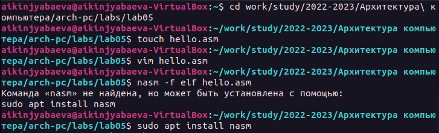
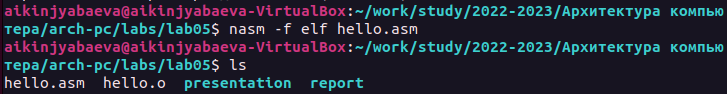
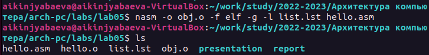
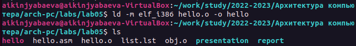
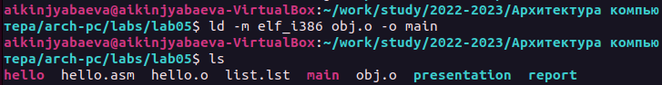
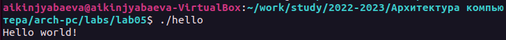
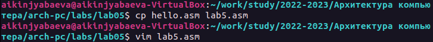
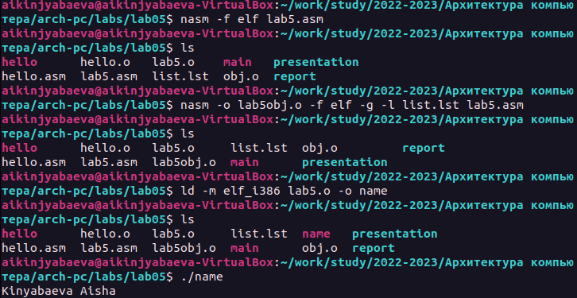
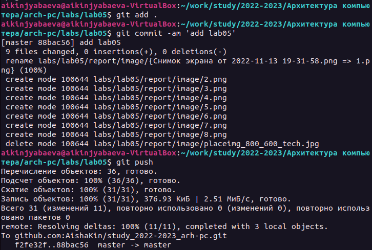

---
## Front matter
title: "Лабораторная работа №5"
subtitle: "Создание и процесс обработки программ на языке ассемблера NASM"
author: "Киньябаева Аиша Иделевна"

## Generic otions
lang: ru-RU
toc-title: "Содержание"

## Bibliography
bibliography: bib/cite.bib
csl: pandoc/csl/gost-r-7-0-5-2008-numeric.csl

## Pdf output format
toc: true # Table of contents
toc-depth: 2
lof: true # List of figures
lot: true # List of tables
fontsize: 12pt
linestretch: 1.5
papersize: a4
documentclass: scrreprt
## I18n polyglossia
polyglossia-lang:
  name: russian
  options:
	- spelling=modern
	- babelshorthands=true
polyglossia-otherlangs:
  name: english
## I18n babel
babel-lang: russian
babel-otherlangs: english
## Fonts
mainfont: PT Serif
romanfont: PT Serif
sansfont: PT Sans
monofont: PT Mono
mainfontoptions: Ligatures=TeX
romanfontoptions: Ligatures=TeX
sansfontoptions: Ligatures=TeX,Scale=MatchLowercase
monofontoptions: Scale=MatchLowercase,Scale=0.9
## Biblatex
biblatex: true
biblio-style: "gost-numeric"
biblatexoptions:
  - parentracker=true
  - backend=biber
  - hyperref=auto
  - language=auto
  - autolang=other*
  - citestyle=gost-numeric
## Pandoc-crossref LaTeX customization
figureTitle: "Рис."
tableTitle: "Таблица"
listingTitle: "Листинг"
lofTitle: "Список иллюстраций"
lolTitle: "Листинги"
## Misc options
indent: true
header-includes:
  - \usepackage{indentfirst}
  - \usepackage{float} # keep figures where there are in the text
  - \floatplacement{figure}{H} # keep figures where there are in the text
---

# Цель работы

	Целью работы является освоение процедуры компиляции и сборки программ, написанных на ассемблере NASM.

# Задание

Изучение языка ассемблера NASM, написание базовых программ 'Hello world!'

# Выполнение лабораторной работы

	Создание файлов для работы на языке NASM (рис. [-@fig:fig1])

{ #fig:fig1 width=70% }

	Трансляция данного файла в объектный (рис. [-@fig:fig2])

{#fig:fig2 width=70%}

	Компоновка объектного файла (рис. [-@fig:fig3])

{#fig:fig3 width=70%}

	Получение исполняемой программы (рис. [-@fig:fig4])

{#fig:fig4 width=70%}

	Создание еще одного исполняемого файла с заданным другим названием (рис. [-@fig:fig5])

{#fig:fig5 width=70%}

	Запуск созданного исполняемого файла (рис. [-@fig:fig6])

{#fig:fig6 width=70%}

	Самостоятельная работа (рис. [-@fig:fig7]),(рис. [-@fig:fig8])

{#fig:fig7 width=70%}
{#fig:fig8 width=70%}

	Загрузка всех файлов на Git(рис. [-@fig:fig9])
{#fig:fig9 width=70%}

	Далее создается отчет по 5й лабораторной работе с помощью Markdown.

# Выводы

	В ходе данной лабораторной работы был изучен язык ассемблера NASM, были написаны базовые программы
