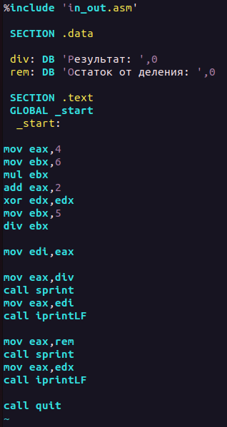

---
## Front matter
title: "Лабораторная работа №7"
subtitle: "Арифметические операции в NASM"
author: "Киньябаева Аиша Иделевна"

## Generic otions
lang: ru-RU
toc-title: "Содержание"

## Bibliography
bibliography: bib/cite.bib
csl: pandoc/csl/gost-r-7-0-5-2008-numeric.csl

## Pdf output format
toc: true # Table of contents
toc-depth: 2
lof: true # List of figures
fontsize: 12pt
linestretch: 1.5
papersize: a4
documentclass: scrreprt
## I18n polyglossia
polyglossia-lang:
  name: russian
  options:
	- spelling=modern
	- babelshorthands=true
polyglossia-otherlangs:
  name: english
## I18n babel
babel-lang: russian
babel-otherlangs: english
## Fonts
mainfont: PT Serif
romanfont: PT Serif
sansfont: PT Sans
monofont: PT Mono
mainfontoptions: Ligatures=TeX
romanfontoptions: Ligatures=TeX
sansfontoptions: Ligatures=TeX,Scale=MatchLowercase
monofontoptions: Scale=MatchLowercase,Scale=0.9
## Biblatex
biblatex: true
biblio-style: "gost-numeric"
biblatexoptions:
  - parentracker=true
  - backend=biber
  - hyperref=auto
  - language=auto
  - autolang=other*
  - citestyle=gost-numeric
## Pandoc-crossref LaTeX customization
figureTitle: "Рис."
listingTitle: "Листинг"
lofTitle: "Список иллюстраций"
lolTitle: "Листинги"
## Misc options
indent: true
header-includes:
  - \usepackage{indentfirst}
  - \usepackage{float} # keep figures where there are in the text
  - \floatplacement{figure}{H} # keep figures where there are in the text
---

# Цель работы

Целью работы является освоение арифметических инструкций языка ассемблера NASM.

# Задание

Освоение арифметических инструкций языка ассемблера NASM и написание программ для вычисление заданных выражений.

# Выполнение лабораторной работы

Написание первой программы lab7-1.asm, которая работает с числами, представленными через ASCII. В результате мы видим знак "j", так как программа сложила двоичные коды введенных нами значений. (рис. [-@fig:fig1])

{ #fig:fig1 width=70% }

Далее мы преобразовываем программу и заменяем значения с кавычками на обычные цифры. В ответе получаем пустую строку, что соотвествует символу STX (рис. [-@fig:fig2]),(рис. [#fig:fig3])

{ #fig:fig2 width=30% }

{#fig:fig3 width=70%}

Пишем еще одну программу lab7-2.asm с небольшими изменениями. В результате получаем число 106, т.к. данная программа преобразовывает полученный код в число (рис. [-@fig:fig4])

{#fig:fig4 width=70%}

Опять же меняем значения с кавычками на обычные числа и получаем нужный нам ответ в виде суммы введенных чисел (рис. [-@fig:fig5])

{#fig:fig5 width=70%}

Поменяв функцию iprintLF на iprint видим, как программа выводит значение без последующего переноса строки, из-за чего строка ввода "налезла" на вывод (рис. [-@fig:fig6]), (рис. [-@fig:fig7])

{#fig:fig6 width=30%}

{#fig:fig7 width=70%}

Пишем программу, выполняющую более сложные арифметические операции (а конкретно (5х2+3)/3) (рис. [-@fig:fig8]), (рис. [-@fig:fig9])

{#fig:fig8 width=50%}

{#fig:fig9 width=70%}

Пишем аналогичную программу, вычисляющую (4х6+2)/5 (рис. [-@fig:fig10]), (рис. [-@fig:fig11])

{#fig:fig10 width=50%}

{#fig:fig11 width=70%}

Далее пишем программу, которая выдает номер варианта в соотвествии с остатком от деления номера студенческого билета на 20 (у меня вышел 4 варниант) (рис. [-@fig:fig12]), (рис. [-@fig:fig13])

{#fig:fig12 width=50%}

{#fig:fig13 width=70%}

ОТВЕТЫ НА ВОПРОСЫ:

1. За вывод на экран сообщения "Ваш вариант: " отвечают строки 
   
   mov eax,rem
   call sprint

2. Данные инструкции используются для:

   mov ecx, x - записывает адрес вводимого "х" в есх
   mov edx, 80 - задает длину вводимой строки
   call sread - в целом позволяет вводить строку с клавиатуры

3. Инструкция "call atoi" используется для преобразования ASCII  кода в число

4. За вычисление варианта отвечают строки:

   xor edx,edx
   mov ebx,20
   div ebx
   inc edx

5. Остаток от деления записывается в регистр edx

6. Данная интсрукция используется для добавления единицы к значению edx

7. За вывод результата вычислений отвечают строчки:

   mov eax,edx
   call iprintLF

САМОСТОЯТЕЛЬНАЯ РАБОТА

Из полученного ранее варианта 4 пишу код, вычисляющий выражение 4/3(х-1)+5 (рис. [-@fig:fig14]), (рис. [-@fig:fig15])

{#fig:fig14 width=50%}

{#fig:fig15 width=70%}

Загрузка всех файлов на Git

Далее создается отчет по 7й лабораторной работе с помощью Markdown.

# Выводы

В ходе данной лабораторной работы были приобретены навыки работы с языком ассемблера NASM и изучены некоторые команды для вычисления арифметических операций.
