---
## Front matter
title: "Лабораторная работа №8"
subtitle: "Команды безусловного и условного переходов в Nasm. Программирование ветвлений."
author: "Киньябаева Аиша Иделевна"

## Generic otions
lang: ru-RU
toc-title: "Содержание"

## Bibliography
bibliography: bib/cite.bib
csl: pandoc/csl/gost-r-7-0-5-2008-numeric.csl

## Pdf output format
toc: true # Table of contents
toc-depth: 2
lof: true # List of figures
fontsize: 12pt
linestretch: 1.5
papersize: a4
documentclass: scrreprt
## I18n polyglossia
polyglossia-lang:
  name: russian
  options:
	- spelling=modern
	- babelshorthands=true
polyglossia-otherlangs:
  name: english
## I18n babel
babel-lang: russian
babel-otherlangs: english
## Fonts
mainfont: PT Serif
romanfont: PT Serif
sansfont: PT Sans
monofont: PT Mono
mainfontoptions: Ligatures=TeX
romanfontoptions: Ligatures=TeX
sansfontoptions: Ligatures=TeX,Scale=MatchLowercase
monofontoptions: Scale=MatchLowercase,Scale=0.9
## Biblatex
biblatex: true
biblio-style: "gost-numeric"
biblatexoptions:
  - parentracker=true
  - backend=biber
  - hyperref=auto
  - language=auto
  - autolang=other*
  - citestyle=gost-numeric
## Pandoc-crossref LaTeX customization
figureTitle: "Рис."
listingTitle: "Листинг"
lofTitle: "Список иллюстраций"
lolTitle: "Листинги"
## Misc options
indent: true
header-includes:
  - \usepackage{indentfirst}
  - \usepackage{float} # keep figures where there are in the text
  - \floatplacement{figure}{H} # keep figures where there are in the text
---

# Цель работы

Целью данной работы является изучение команд условного и безусловного переходов, приобретение навыков написания программ с использованием переходов, знакомство с назначением и структурой файла листинга

# Задание

Освоение команд сравнения значений и написание программ, связанных с этим, изучение структуры листинга.

# Выполнение лабораторной работы

Написание первой программы lab8-1.asm, которая показывает переходы в программе с использование команды jmp. В результате мы получаем "Сообщение №2", "Сообщение №3" (рис. [-@fig:fig1]), (рис. [-@fig:fig2])

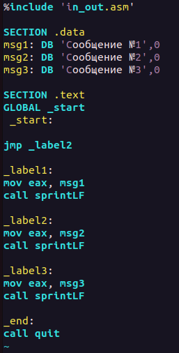{ #fig:fig1 width=30% }

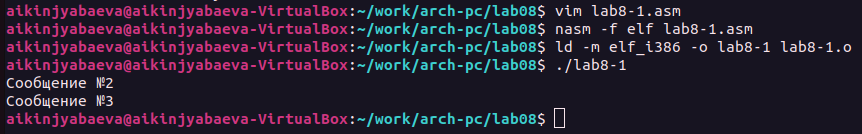{ #fig:fig2 width=70% }

Далее мы преобразовываем программу, чтобы она выводила "Сообщение №2", "Сообщение №1" (рис. [#fig:fig3]), (рис. [-@fig:fig4])

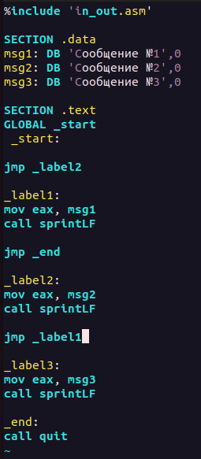{ #fig:fig3 width=30% }

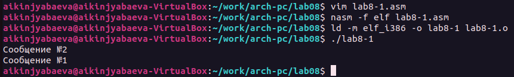{#fig:fig4 width=70%}

Далее преобразовываю программу так, чтобы она выводила сообщения в обратном порядке. (рис. [-@fig:fig5]), (рис. [-@fig:fig6])

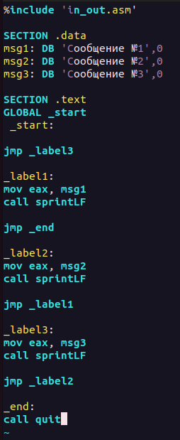{#fig:fig5 width=30%}

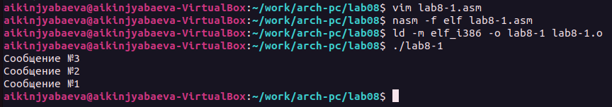{#fig:fig6 width=70%}

Создаем новый файл lab8-2.asm, который находит наибольшее значение из двух данных и третьтего введенного.(рис. [-@fig:fig7])

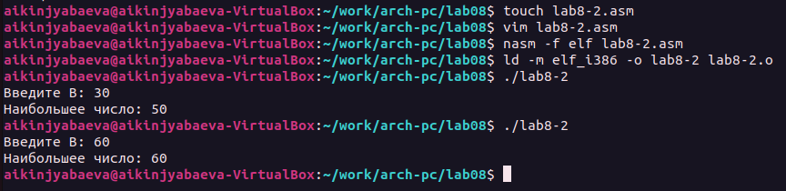{#fig:fig7 width=70%}

Знакомство с листингом. Создаю файл листинга и изучаю его. На картинке представлен фрагмент (рис. [-@fig:fig8])

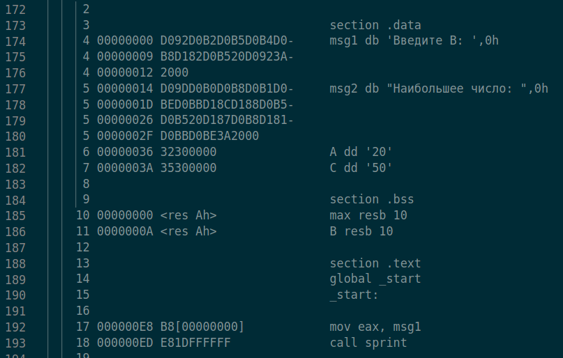{#fig:fig8 width=70%}

Поменяв код lab8-2.asm, вижу как терминал выдает ошибку, а при просмотре листингового файла можно также заметить ошибку (рис. [-@fig:fig9]), (рис. [-@fig:fig10]), (рис. [-@fig:fig11])

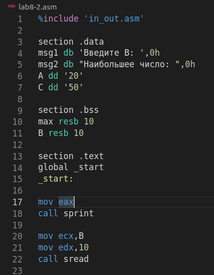{#fig:fig9 width=50%}

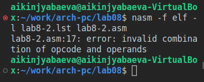{#fig:fig10 width=40%}

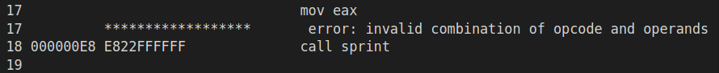{#fig:fig11 width=70%}

Ниже представлен еще один фрагмент листинга. В нем видим:(рис. [-@fig:fig12])
1. 41 - номер строки
   0000013А - адрес
   8B0D[00000000] - машинный код
   mov ecx,[max] - исходный текст программы (в данном случае значащее ecx = max )
2. 42 - номер строки
   00000140 - адрес
   3B0D[0A000000] - машинный код
   cmp ecx,[B] - исходный текст программы (в данном случае значащее сравнение значения ecx с В )
3. 43 - номер строки
   00000146 - адрес
   7F0C - машинный код
   jg fin - исходный текст программы (в данном случае значащее если max>B, то переход к fin )

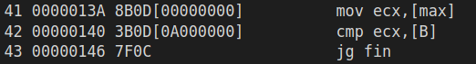{#fig:fig12 width=70%}

САМОСТОЯТЕЛЬНАЯ РАБОТА

Из прошлой лабораторной работы мне попался 4й вариант.

Для первого задания пишу программу, находящую наименьшее число из 3х введенных (рис. [-@fig:fig13]), (рис. [-@fig:fig14]), (рис. [-@fig:fig15])

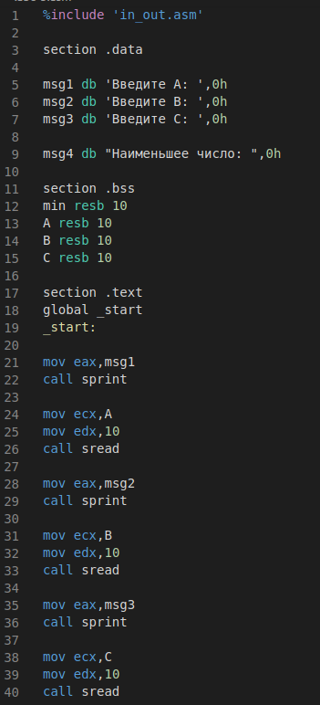{#fig:fig13 width=30%}

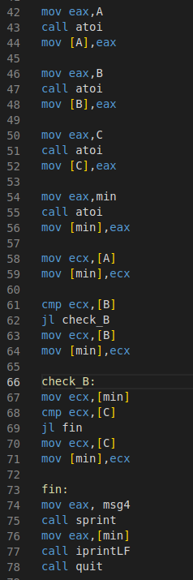{#fig:fig14 width=30%}

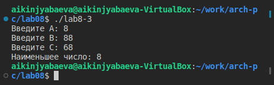{#fig:fig15 width=70%}

Для второго задания пишу программу, вычисляющую функции 2х+а или 2х+1 в зависимости от переменной а (рис. [-@fig:fig16]), (рис. [-@fig:fig17])

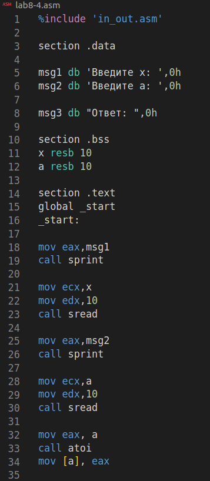{#fig:fig16 width=30%}

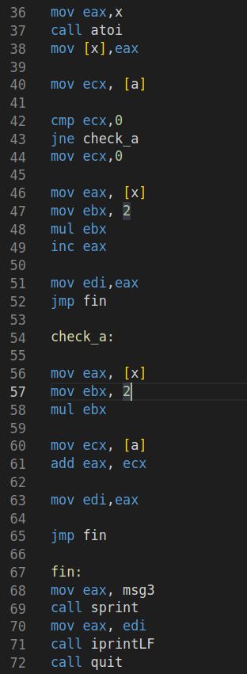{#fig:fig17 width=30%}

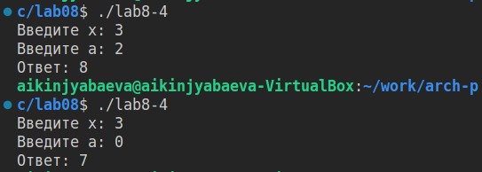{#fig:fig18 width=70%}

Загрузка всех файлов на Git.

Далее создается отчет по 8й лабораторной работе с помощью Markdown.

# Выводы

В ходе данной лабораторной работы были изучены команды условного и безусловного переходов, приобретены навыки написания программ с данными командами. Также была изучена структура листинга.