---
## Front matter
title: "Лабораторная работа №9"
subtitle: "Программирование цикла. Обработка аргументов командной строки."
author: "Киньябаева Аиша Иделевна"

## Generic otions
lang: ru-RU
toc-title: "Содержание"

## Bibliography
bibliography: bib/cite.bib
csl: pandoc/csl/gost-r-7-0-5-2008-numeric.csl

## Pdf output format
toc: true # Table of contents
toc-depth: 2
lof: true # List of figures
fontsize: 12pt
linestretch: 1.5
papersize: a4
documentclass: scrreprt
## I18n polyglossia
polyglossia-lang:
  name: russian
  options:
	- spelling=modern
	- babelshorthands=true
polyglossia-otherlangs:
  name: english
## I18n babel
babel-lang: russian
babel-otherlangs: english
## Fonts
mainfont: PT Serif
romanfont: PT Serif
sansfont: PT Sans
monofont: PT Mono
mainfontoptions: Ligatures=TeX
romanfontoptions: Ligatures=TeX
sansfontoptions: Ligatures=TeX,Scale=MatchLowercase
monofontoptions: Scale=MatchLowercase,Scale=0.9
## Biblatex
biblatex: true
biblio-style: "gost-numeric"
biblatexoptions:
  - parentracker=true
  - backend=biber
  - hyperref=auto
  - language=auto
  - autolang=other*
  - citestyle=gost-numeric
## Pandoc-crossref LaTeX customization
figureTitle: "Рис."
listingTitle: "Листинг"
lofTitle: "Список иллюстраций"
lolTitle: "Листинги"
## Misc options
indent: true
header-includes:
  - \usepackage{indentfirst}
  - \usepackage{float} # keep figures where there are in the text
  - \floatplacement{figure}{H} # keep figures where there are in the text
---

# Цель работы

Целью данной работы является приобретение навыков написания программ с использованием циклов и обработкой аргументов командной строки.

# Задание

Освоение команд написания циклов, работа с аргументами командной строки, написание программ с использованием аргументов.

# Выполнение лабораторной работы

Написание первой программы lab9-1.asm, которая вычитает единицу из введенного значения, пока ecx не достигнет 0 (однако первым выводом является число 3, т.к. мы сопоставляем ecx=N) (рис. [-@fig:fig1]), (рис. [-@fig:fig2])

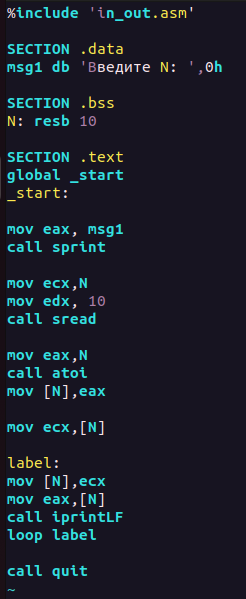{ #fig:fig1 width=30% }

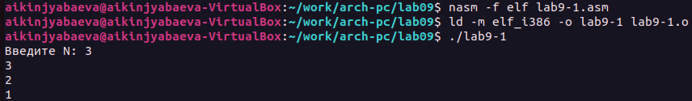{ #fig:fig2 width=70% }

Далее мы преобразовываем программу, в результате чего она работает некорректно, отнимает две единицы вместо одной, а при введении нечетного числа выводит абсолютно не то, что нам нужно. Число проходов ни в одном из вариантов не соответствует введенному числу (рис. [#fig:fig3]), (рис. [-@fig:fig4]), (рис. [-@fig:fig5])

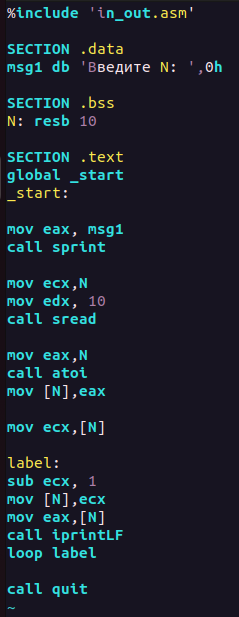{#fig:fig3 width=30%}

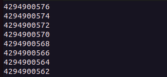{#fig:fig4 width=70%}

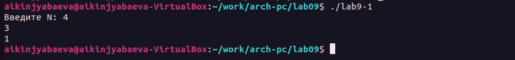{#fig:fig5 width=70%}

Еще одно преобразование, в котором уже используется стек. А в результате мы получаем схожий с первой программой результат, но с выводом первого элемента уже уменьшенным на единицу. Число проходов на этот раз соответствует введенному числу (рис. [-@fig:fig6]), (рис. [-@fig:fig7])

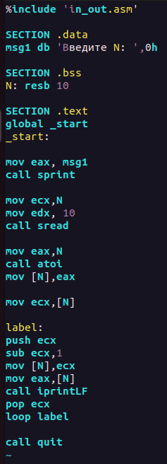{#fig:fig6 width=30%}

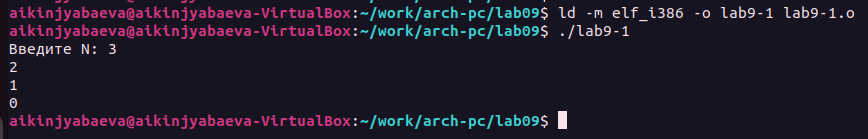{#fig:fig7 width=70%}

Создаем новый файл lab9-2.asm, который выводит введенные аргументы. Видим как аргументом считается все до пробела (рис. [-@fig:fig8]), (рис. [-@fig:fig9])

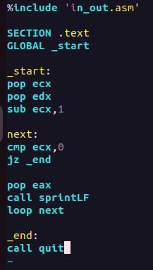{#fig:fig8 width=40%}

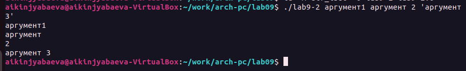{#fig:fig9 width=70%}

Следующая программа lab9-3.asm. Она выводит сумму введенных аргументов (рис. [-@fig:fig10]), (рис. [-@fig:fig11])

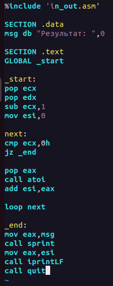{#fig:fig10 width=30%}

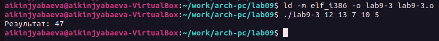{#fig:fig11 width=70%}

Преобразовываю программу так, чтобы она выводила произведение введенных аргументов (рис. [-@fig:fig12]), (рис. [-@fig:fig13])

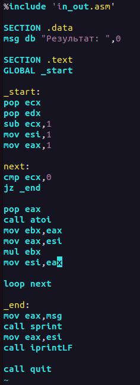{#fig:fig12 width=30%}

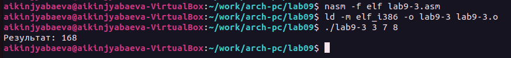{#fig:fig13 width=70%}

САМОСТОЯТЕЛЬНАЯ РАБОТА

Из прошлой лабораторной работы мне попался 4й вариант.

Пишу программу, выводящую заданную формулу и сумму вычисленных значений (рис. [-@fig:fig14]), (рис. [-@fig:fig15])

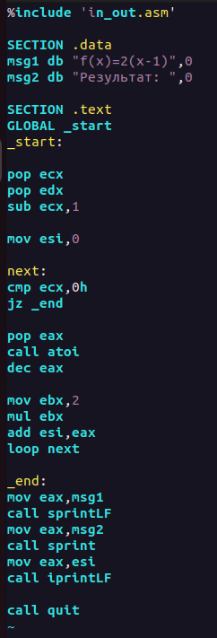{#fig:fig14 width=30%}

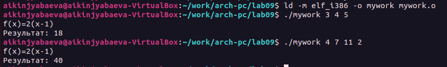{#fig:fig15 width=70%}

Загрузка всех файлов на Git.

Далее создается отчет по 9й лабораторной работе с помощью Markdown.

# Выводы

В ходе данной лабораторной работы были изучены циклы и обработка аргументов командной строки. Были освоены и использованы на практике основные команды циклов и стеков.
