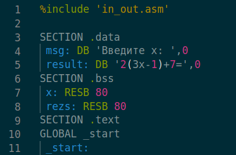
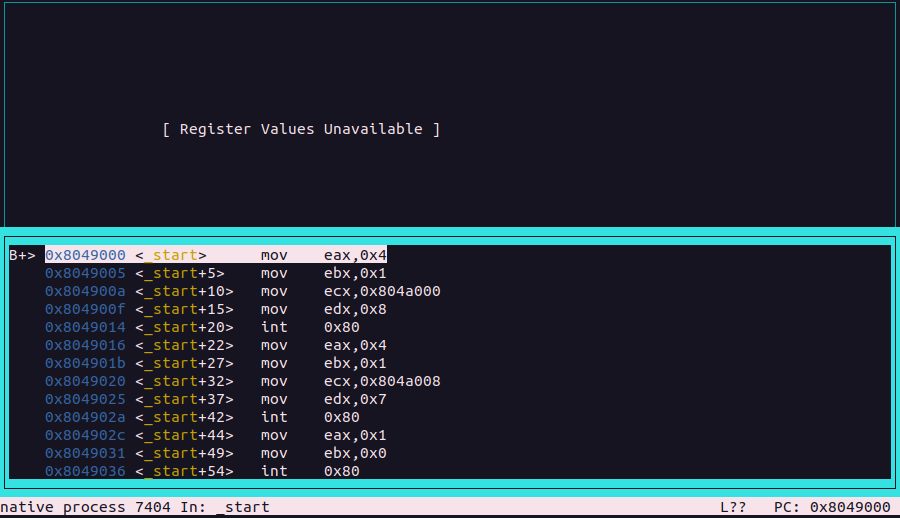

---
## Front matter
title: "Лабораторная работа №10"
subtitle: "Понятие подпрограммы. Отладчик GDB."
author: "Киньябаева Аиша Иделевна"

## Generic otions
lang: ru-RU
toc-title: "Содержание"

## Bibliography
bibliography: bib/cite.bib
csl: pandoc/csl/gost-r-7-0-5-2008-numeric.csl

## Pdf output format
toc: true # Table of contents
toc-depth: 2
lof: true # List of figures
fontsize: 12pt
linestretch: 1.5
papersize: a4
documentclass: scrreprt
## I18n polyglossia
polyglossia-lang:
  name: russian
  options:
	- spelling=modern
	- babelshorthands=true
polyglossia-otherlangs:
  name: english
## I18n babel
babel-lang: russian
babel-otherlangs: english
## Fonts
mainfont: PT Serif
romanfont: PT Serif
sansfont: PT Sans
monofont: PT Mono
mainfontoptions: Ligatures=TeX
romanfontoptions: Ligatures=TeX
sansfontoptions: Ligatures=TeX,Scale=MatchLowercase
monofontoptions: Scale=MatchLowercase,Scale=0.9
## Biblatex
biblatex: true
biblio-style: "gost-numeric"
biblatexoptions:
  - parentracker=true
  - backend=biber
  - hyperref=auto
  - language=auto
  - autolang=other*
  - citestyle=gost-numeric
## Pandoc-crossref LaTeX customization
figureTitle: "Рис."
listingTitle: "Листинг"
lofTitle: "Список иллюстраций"
lolTitle: "Листинги"
## Misc options
indent: true
header-includes:
  - \usepackage{indentfirst}
  - \usepackage{float} # keep figures where there are in the text
  - \floatplacement{figure}{H} # keep figures where there are in the text
---

# Цель работы

Целью работы является приобретение навыков написания программ с использованием подпрограмм. Знакомство с методами отладки при помощи GDB и его основными возможно-
стями.

# Задание

Научиться отладке программы с помощью отладчика GDB и изучение подпрограмм. 

# Выполнение лабораторной работы

Пишу программу с использованием с подпрограммы для вычисления выражения: 2x + 7 (рис. [-@fig:fig1]), (рис. [-@fig:fig2])

{ #fig:fig1 width=30% }

{ #fig:fig2 width=70% }

Меняем программу, чтобы она вычисляла: f(g(x)) = 2(3x - 1) + 7 (рис. [#fig:fig3]), (рис. [-@fig:fig4]), (рис. [-@fig:fig5])

{#fig:fig4 width=30%}

{#fig:fig3 width=30%}

{#fig:fig5 width=70%}

Создаем программу для вывода надписи: Hello world, компилируем листинг файл с отладочной информацией, проверяем с помощью дебаггера GDB.(рис. [-@fig:fig6]), (рис. [-@fig:fig7])

{#fig:fig6 width=70%}

{#fig:fig7 width=70%}

Устанавливаем break на метку _start, смотрим работу программы и далее запускаем диссамилированный код. Переключаемся на Intel'овский синтаксис. Различия синтаксисов заключается в разном отображении аргументов и значений(в Intel без доп. символов), а так же изменен порядок их отображения(рис. [-@fig:fig8]), (рис. [-@fig:fig9])

{#fig:fig8 width=70%}

{#fig:fig9 width=70%}

Два режима псевдографики(рис. [-@fig:fig10]), (рис. [-@fig:fig11])

{#fig:fig10 width=70%}

{#fig:fig11 width=70%}

В режиме дебаггинга проверяем точки остановы, и видим, что можем установить еще одну, используя адрес инструкции (рис. [-@fig:fig12])

{#fig:fig12 width=70%}

Проверяем значения регистров(рис. [-@fig:fig13])

{#fig:fig13 width=70%}

Провела 5 инструкций с помощью команды si, меняются значения регистров: eax, ebx, ecx, edx. (рис. [-@fig:fig14])

{#fig:fig14 width=70%}

Видим, что с помощью различных команд можно смотреть содержимое переменных(в конце скриншота просмотрено значение переменной msg2) (рис. [-@fig:fig15])

{#fig:fig15 width=40%}

А с помощью команды set можно менять значение регистра(в конце скриншота изменен символ второй переменной msg2)(рис. [-@fig:fig16])

{#fig:fig16 width=40%}

Изучаем использование команды print /F, которое смотрит значение регистров(можно регулировать формат отображения). Вывела в различных форматах значение регистра edx(16ричных, 2чный и символьный вид соотвественно)(рис. [-@fig:fig17])

{#fig:fig17 width=40%}

С помощью команды set, меняем значение регистра ebx (рис. [-@fig:fig18])

{#fig:fig18 width=40%}

Указываем аргументы файла в отладчик и далее смотрим позиции аргумента в стеке. Заметим, что [esp + 24] не выводит значения, так как у нас нет 6го аргумента. Шаг изменения адреса равен 4, потому что память имеет 16ричный вид, и 2^4=16.(рис. [-@fig:fig19])

{#fig:fig19 width=70%}

САМОСТОЯТЕЛЬНАЯ РАБОТА

1.Меняю программу из 9 лаб. работы, которая вычисляла 2(x-1) с использованием подпрограмм (рис. [-@fig:fig20]), (рис. [-@fig:fig21])

{#fig:fig20 width=30%}

{#fig:fig21 width=70%}

2.Находим ошибка в листинге, для этого используем GDB, смотрим значение регистров. Просматриваю каждый шаг программы с помощью si (рис. [-@fig:fig22]), (рис. [-@fig:fig23]), (рис. [-@fig:fig24]), (рис. [-@fig:fig25]), (рис. [-@fig:fig26]), (рис. [-@fig:fig27]), (рис. [-@fig:fig28])

{#fig:fig22 width=70%}

{#fig:fig23 width=70%} 

{#fig:fig24 width=70%} 

{#fig:fig25 width=70%} 

{#fig:fig26 width=70%} 

{#fig:fig27 width=70%} 

{#fig:fig28 width=70%}

Видим, что ошибка в том, что программа умножает на 4 двойку из eax. Исправляем программу в редакторе.
(рис. [-@fig:fig29]), (рис. [-@fig:fig30])

{#fig:fig29 width=30%}

{#fig:fig30 width=70%}

Загрузка всех файлов на Git.

Далее создается отчет по 10й лабораторной работе с помощью Markdown.

# Выводы

В ходе данной лабораторной работы были изучены подпрограммы, освнен дебагинг с помощью GDB.
