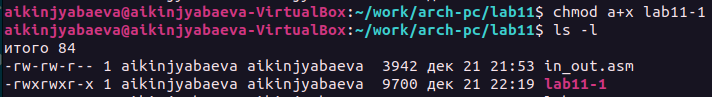

---
## Front matter
title: "Лабораторная работа №11"
subtitle: "Работа с файлами средствами Nasm"
author: "Киньябаева Аиша Иделевна"

## Generic otions
lang: ru-RU
toc-title: "Содержание"

## Bibliography
bibliography: bib/cite.bib
csl: pandoc/csl/gost-r-7-0-5-2008-numeric.csl

## Pdf output format
toc: true # Table of contents
toc-depth: 2
lof: true # List of figures
fontsize: 12pt
linestretch: 1.5
papersize: a4
documentclass: scrreprt
## I18n polyglossia
polyglossia-lang:
  name: russian
  options:
	- spelling=modern
	- babelshorthands=true
polyglossia-otherlangs:
  name: english
## I18n babel
babel-lang: russian
babel-otherlangs: english
## Fonts
mainfont: PT Serif
romanfont: PT Serif
sansfont: PT Sans
monofont: PT Mono
mainfontoptions: Ligatures=TeX
romanfontoptions: Ligatures=TeX
sansfontoptions: Ligatures=TeX,Scale=MatchLowercase
monofontoptions: Scale=MatchLowercase,Scale=0.9
## Biblatex
biblatex: true
biblio-style: "gost-numeric"
biblatexoptions:
  - parentracker=true
  - backend=biber
  - hyperref=auto
  - language=auto
  - autolang=other*
  - citestyle=gost-numeric
## Pandoc-crossref LaTeX customization
figureTitle: "Рис."
listingTitle: "Листинг"
lofTitle: "Список иллюстраций"
lolTitle: "Листинги"
## Misc options
indent: true
header-includes:
  - \usepackage{indentfirst}
  - \usepackage{float} # keep figures where there are in the text
  - \floatplacement{figure}{H} # keep figures where there are in the text
---

# Цель работы

Целью работы является приобретение навыков написания программ для работы с файлами, доступом к ним и их содержанием.

# Задание

Научиться менять доступ к файлам, научиться писать программы работы с файлами.

# Выполнение лабораторной работы

Пишу программу записи сообщения в файл (рис. [-@fig:fig1]), (рис. [-@fig:fig2])

{ #fig:fig1 width=30% }

{ #fig:fig2 width=70% }

Меняю права доступа к исполняемому файлу lab11-1, запретив его выполнение. В результате видим, что не можем запустить исполняемый файл, так как мы всем запретили выполнять файл, в том числе владельцу (рис. [#fig:fig3]), (рис. [-@fig:fig4])

{#fig:fig3 width=70%}

{#fig:fig4 width=70%}

Вернув права на исполнение обратно, видим как программа нормально запускается (рис. [-@fig:fig5]), (рис. [-@fig:fig6])

{#fig:fig5 width=70%}

{#fig:fig6 width=70%}

Предоставляю права доступа к файлу readme.txt в соотвествии с моим вариантом (4), то есть -w- --- -w- (рис. [-@fig:fig7])

{#fig:fig7 width=70%}

САМОСТОЯТЕЛЬНАЯ РАБОТА

Пишу программу в соответствии с данным нам алгоритмом. Запускаю его и проверяю наличие созданного фпайла, а также его содержимое (рис. [-@fig:fig8]), (рис. [-@fig:fig9])

{#fig:fig8 width=30%}

{#fig:fig9 width=70%}

Загрузка всех файлов на Git.

Далее создается отчет по 11й лабораторной работе с помощью Markdown.

# Выводы

В ходе данной лабораторной работы были изучены команды для работы с файлами, для смены доступа к ним.